# Hướng dẫn setup môi trường

## Mục lục

> [1, Cài JDK cho ứng dụng web](#1-cài-jdk-cho-ứng-dụng-web--về-đầu-trang)<br>
> [2, Cài MySQL Server](#2-cài-mysql-server--về-đầu-trang)<br>
> [3, Cài Tomcat Server](#3-cài-tomcat-server--về-đầu-trang)<br>
> [4, Hướng dẫn cấu hình ứng dụng](#4-hướng-dẫn-cấu-hình-ứng-dụng--về-đầu-trang)<br>
> [Chú ý](#chú-ý--về-đầu-trang)

## 1, Cài JDK cho ứng dụng web | [Về đầu trang](#mục-lục)

B1: Kiểm tra xem JDK đã được cài đặt trên máy chưa

```terminal
sudo apt update
java -version
```
Nếu java chưa được cài đặt, thông báo sau sẽ được hiển thị ra terminal
```
Command 'java' not found, but can be installed with:

apt install default-jre
apt install openjdk-11-jre-headless
apt install openjdk-8-jre-headless
```

B2: Cài bản JRE và JDK mặc định để chạy code `java`:

```terminal
$ sudo apt install default-jre
$ sudo apt install default-jdk
```

Kiểm tra lại xem file đã được cài đặt chưa bằng lệnh

```terminal
$ javac -version
```

## 2, Cài MySQL Server | [Về đầu trang](#mục-lục)

Tham khảo tại trang: [https://phoenixnap.com/kb/how-to-install-mysql-on-ubuntu-18-04](https://phoenixnap.com/kb/how-to-install-mysql-on-ubuntu-18-04)

**B1: Cài MySQL bằng lệnh**

```terminal
$ sudo apt-get install mysql-server
```
**B2: Cài đặt thông tin về bảo mật cho MySQL** <br>
Phần này cần đọc kỹ các thông số cài đặt, để hạn chế những bug không lường trước được.
```terminal
$ sudo mysql_secure_installation
```
Cài đặt mật khẩu cho tài khoản root, đây là tài khoản có quyền cao nhất để truy cập vào mysql server, do đó cần tạo một tài khoản có độ bảo mật tốt.

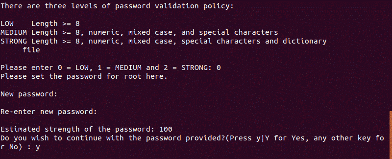

Cài đặt các thông số khác

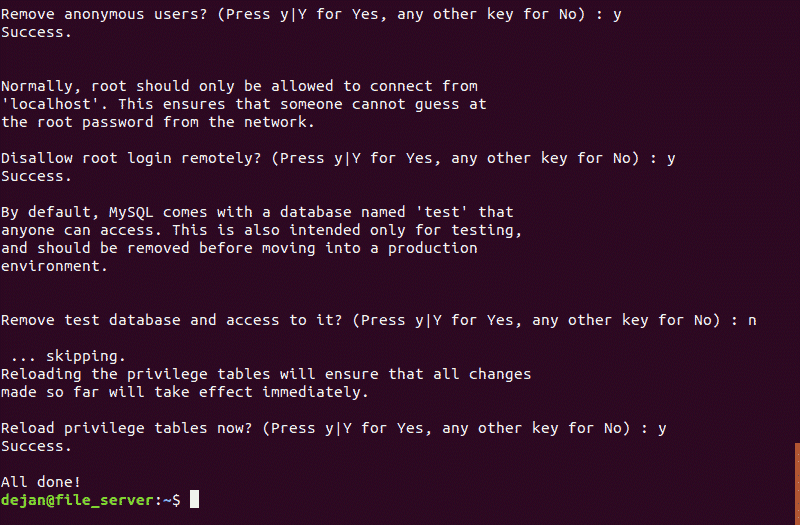

**B3: Các câu lệnh start, stop, check status của MySQL**

Kiểm tra trạng thái 
```terminal
$ sudo service mysql status
```

Chạy mysql service
```terminal
$ sudo service mysql start
```

Dừng mysql service
```terminal
$ sudo service mysql stop
```

**B4: Truy cập MySQL server bằng tài khoản root**

```terminal
$ sudo mysql -u root -p
```

Tới đây, nhập mật khẩu đã cài đặt cho tài khoản `root` ở bước 2

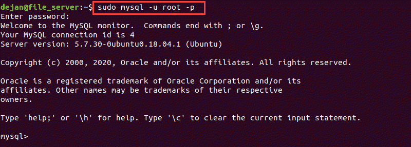

Khi đã truy cập được tài khoản root, tiến hành tạo database cho ứng dụng web ***(Chú ý thực hiện tuần tự các bước)***

```SQL
# Tạo database `image_slider`
CREATE DATABASE `image_slider` 
CHARACTER SET utf8;

# Hiển thị danh sách các database sẵn có
SHOW DATABASES;

# Trỏ tới database để sử dụng
USE `image_slider`;

# Tạo mới bảng `tbl_image`
CREATE TABLE `tbl_image` (
    `image_id` INT NOT NULL AUTO_INCREMENT,
    `image_name` VARCHAR(255) NOT NULL,
    `alternate_text` VARCHAR(255),
    PRIMARY KEY (`image_id`)
);
```

Tạo tài khoản để cấp quyền cho ứng dụng web:

```SQL
# Tạo user mới để test
CREATE USER 'tester'@'localhost' IDENTIFIED BY '0000';

# Cấp quyền cho tester này
GRANT SELECT, INSERT, UPDATE, DELETE, ALTER ON `image_slider`.tbl_image TO 'tester'@'localhost';

# Lưu thay đổi
FLUSH PRIVILEGES;
```

## 3, Cài Tomcat Server | [Về đầu trang](#mục-lục)

B1: Truy cập vào trang chủ của tomcat [https://tomcat.apache.org/download-80.cgi](https://tomcat.apache.org/download-80.cgi) và tải phần mềm về:

- Nếu chạy trên linux thì tải File: [tar.gz](https://tomcat.apache.org/download-80.cgi)<br>
- Nếu chạy trên windown thì tải file: [zip](https://tomcat.apache.org/download-80.cgi)


B2: Sau khi tải về thành công, giải nén file đó sẽ thấy cấu trúc gồm có các thư mục sau:


B3: Ứng dụng web được nén vào file `Image Slide.war`, để deploy ứng dụng lên server cần copy file này vào thư mục **`apache-tomcat-8.5.65\webapps`** như sau:


B4: Thiết lập các thông số của server

Truy cập vào file `tomcat-users.xml`, và tạo một tài khoản đăng nhập vào server
```
apache-tomcat-8.5.65\conf\tomcat-users.xml
```

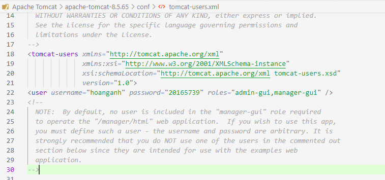

Tùy chỉnh port của server ở file `server.xml`
```
apache-tomcat-8.5.65\conf\server.xml
```

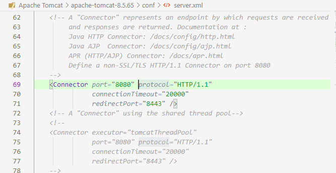

B5: Mở terminal trỏ tới thư mục **`apache-tomcat-8.5.65\bin`**, và chạy server:
- `./startup.sh` với Linux
- `startup` với windown


B6: Deploy ứng dụng lên server bằng GUI

Mở trình duyệt web, gõ địa chỉ `localhost:8080`

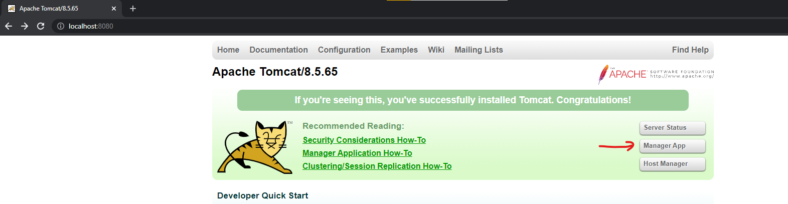

Chọn **Manager App** và đăng nhập

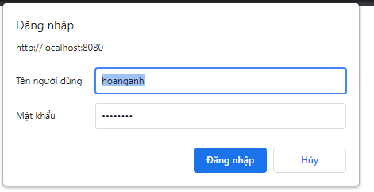

Sau khi đăng nhập thành công sẽ hiển thị giao diện

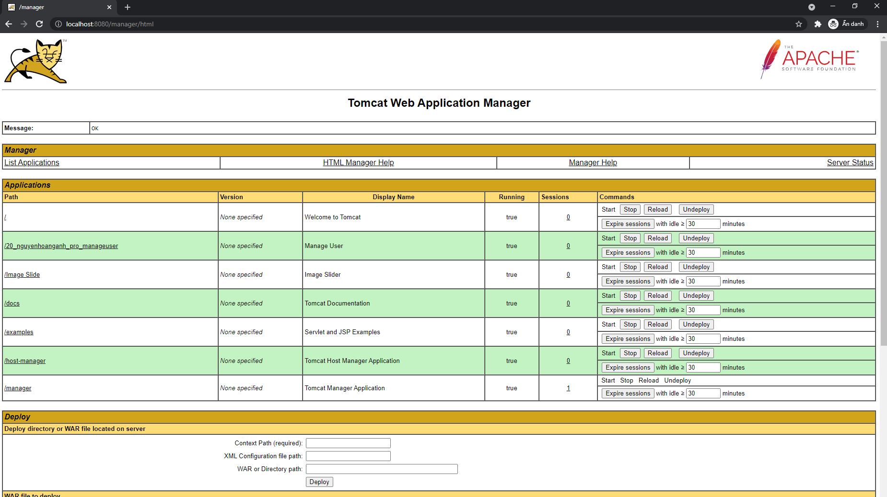


---
## 4, Hướng dẫn cấu hình ứng dụng | [Về đầu trang](#mục-lục)

Các file cấu hình của ứng dụng được lưu tại server, nơi ứng dụng được deploy: 

```
apache-tomcat-8.5.65\webapps\Image Slide\WEB-INF\classes\image\properties
```

**Gồm có các file**
- [config.properties: Lưu trữ các thông tin cấu hình của hệ thống](#41-configproperties)
- [database.properties: Lưu trữ các thông tin để kết nối tới 1 database](#42-databaseproperties)
- [list_image.txt: File lưu các thông tin của ảnh](#43-list_imagetxt)

### 4.1, config.properties

Dùng để cấu hình các thông số của ứng dụng web

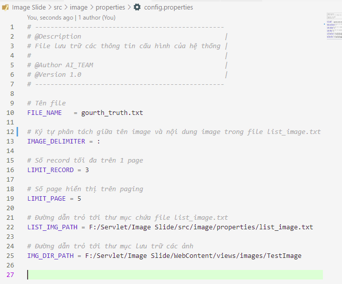

### 4.2, database.properties

File cấu hình các thông tin mở kết nối tới database
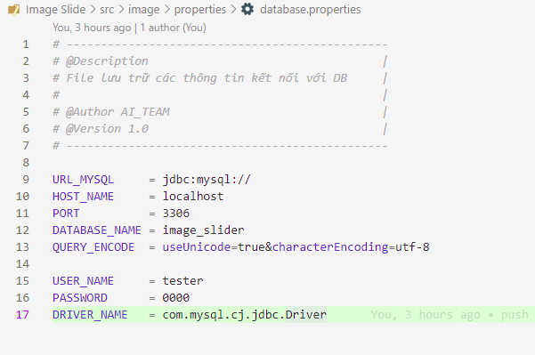

### 4.3, list_image.txt

File lưu thông tin của từng bức ảnh, có định dạng file như sau:
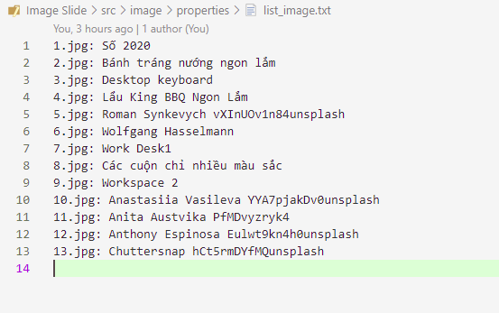

### 4.4, File lưu trữ ảnh

File được nằm ở thư mục
```
apache-tomcat-8.5.65\webapps\Image Slide\views\images\TestImage
```
Ảnh được hiển thị trên web, chỉ có thể lưu trong thư mục này
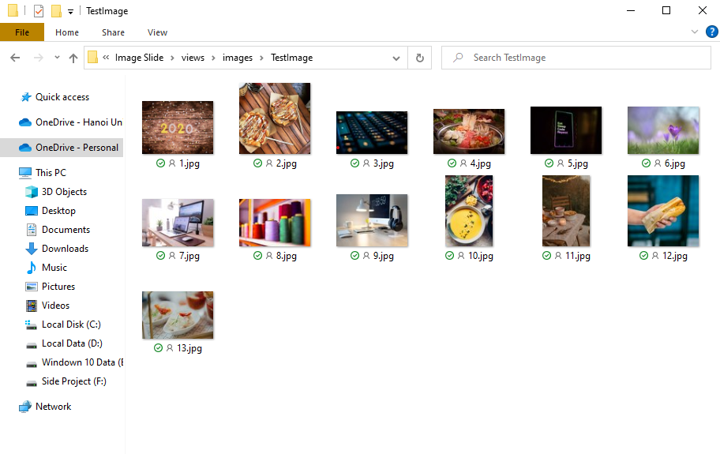

> # Chú ý | [Về đầu trang](#mục-lục)
> - Khi thay đổi nội dung file thì cần vào server và reload lại ứng dụng web<br>
> - Tất cả các ảnh dùng để hiển thị trong slide, cần lưu trữ tại thư mục `TestImage` 
>
> 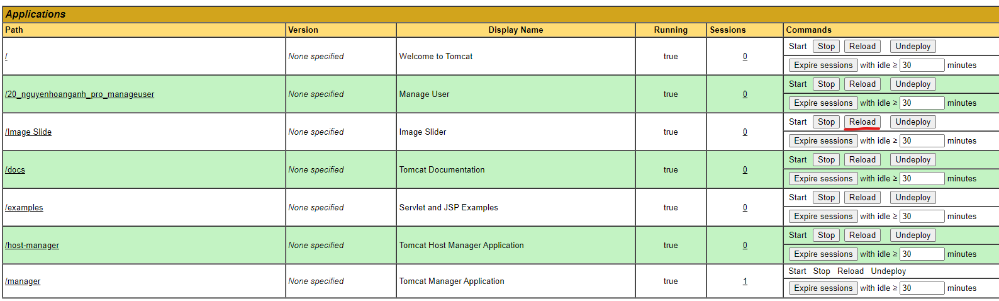

